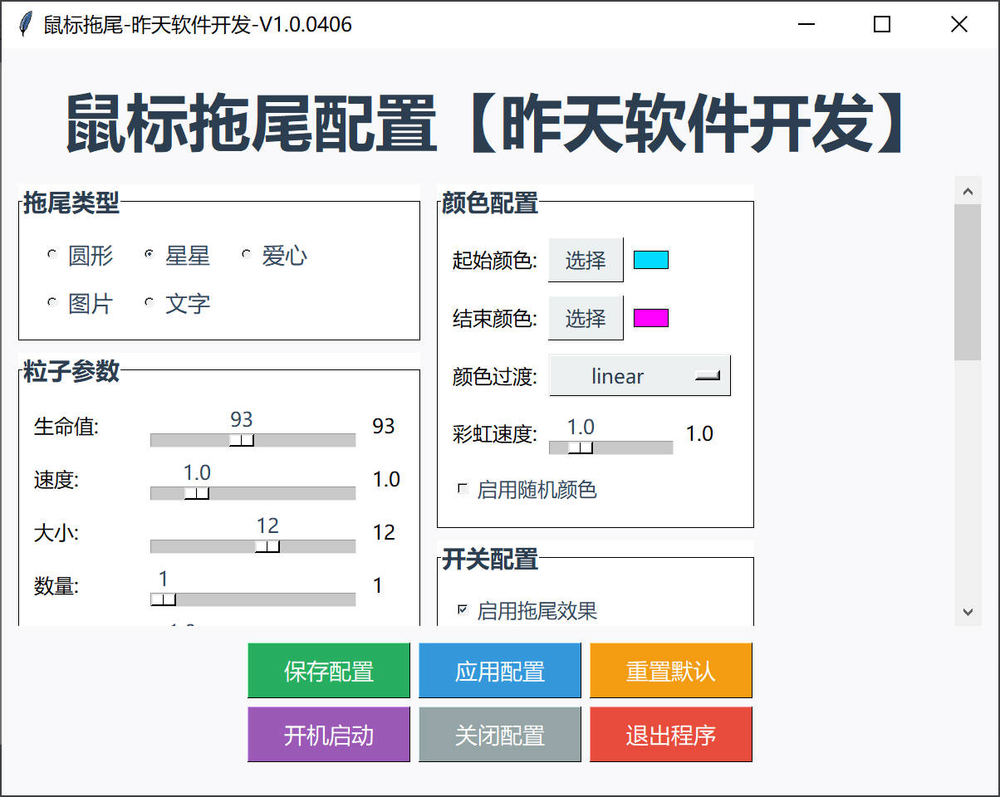
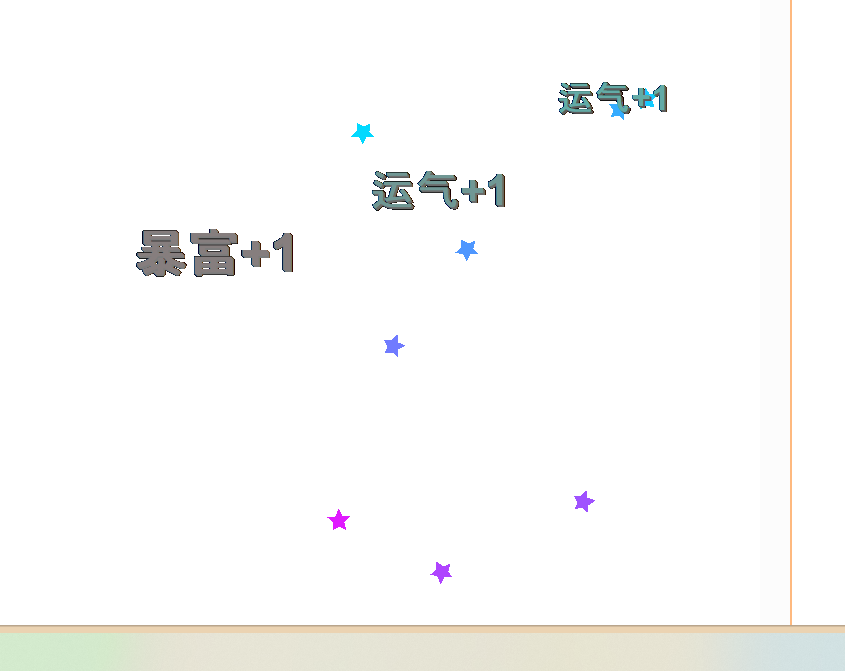

# 鼠标拖尾效果


## 🚀 功能

### 1. **爱心效果改进**
- 爱心形状更明显、更美观
- 增加了轮廓效果，使爱心更清晰
- 默认粒子大小增加到8，效果更显著

### 2. **文字拖尾效果**
- 支持自定义任意文字作为拖尾
- 支持中文、英文、Emoji表情
- 可实时调整文字内容
- 文字大小随粒子大小自动调整

### 3. **鼠标点击效果**
- 左键点击时随机显示文字
- 文字使用分号分隔，可自定义
- 默认包含多种Emoji：✨;🌟;💖;🎉;👍;😊;🎯;💫;🔥;⭐
- 点击文字有向上飘动和逐渐变大效果
- 带阴影效果，更加醒目

## 📋 使用说明

### 运行程序
```bash
python MouseTrail.py
```

### 新功能配置

#### 1. 文字拖尾
1. 在配置窗口选择"文字"拖尾类型
2. 在"文字内容"输入框中输入想要显示的文字
3. 支持Emoji：❤、✨、🌟、🎉 等
4. 支持中文：爱、心、星、彩 等

#### 2. 点击效果
1. 勾选"启用鼠标点击效果"
2. 在"点击文字(用分号分隔)"输入框中设置文字列表
3. 格式：`文字1;文字2;文字3`
4. 示例：`✨;🌟;💖;🎉;👍;😊`
5. 左键点击时随机显示列表中的文字

### 配置界面更新
- **拖尾类型**：新增"文字"选项
- **文字内容**：可自定义拖尾文字
- **点击效果开关**：启用/禁用鼠标点击效果
- **点击文字配置**：自定义点击时显示的文字列表

## 🎨 配置窗口增强版

### 1. **DPI缩放支持**
- 自动检测显示器DPI设置
- 所有控件按DPI比例自动缩放
- 支持高分辨率显示器（2K、4K）
- 适应不同的Windows缩放设置（100%、125%、150%等）

### 2. **滚动功能**
- 配置项过多时自动显示滚动条
- 支持鼠标滚轮滚动
- 流畅的滚动体验
- 保持所有控件可见

### 3. **现代化界面设计**
- 现代化配色方案（浅色主题）
- 清晰的视觉层次结构
- 统一的字体和间距
- 响应式布局设计

### 4. **改进的布局**
- 配置项按功能分组
- 横向布局优化，更节省空间
- 颜色预览区域更明显
- 按钮区域重新设计，操作更直观

### 5. **用户体验优化**
- 窗口居中显示
- 可调整窗口大小
- 鼠标滚轮支持
- 智能控件显示/隐藏

## 🎯 效果预览

### 拖尾效果
- **圆形**：传统圆形粒子
- **星星**：五角星形状
- **爱心**：明显的爱心形状（改进版）
- **图片**：自定义图片
- **文字**：自定义文字/Emoji

### 点击效果
- 左键点击时显示随机文字
- 文字向上飘动并逐渐变大
- 带阴影效果，更加醒目
- 可完全自定义文字内容

## ⚙️ 配置示例

### 文字拖尾配置
```
拖尾类型：文字
文字内容：❤
粒子大小：12
生成数量：3
```

### 点击效果配置
```
启用鼠标点击效果：是
点击文字：✨;🌟;💖;🎉;👍;😊;🎯;💫;🔥;⭐
```

## 🔧 技术改进

### 爱心效果
- 使用改进的爱心参数方程
- 增加了轮廓线条
- 自动计算轮廓颜色
- 尺寸放大3倍，更明显

### 文字效果
- 支持透明度渐变
- 字体大小随粒子大小调整
- 支持RGBA颜色格式
- 兼容各种Unicode字符

### 点击检测
- 使用Windows API实时检测鼠标点击
- 准确识别左键按下事件
- 支持快速连续点击

## 🐛 故障排除

### 1. 爱心不显示或太小
- 增加"粒子大小"参数
- 检查"启用拖尾效果"是否勾选
- 确保选择了"爱心"拖尾类型

### 2. 文字拖尾不显示
- 检查文字内容是否包含特殊字符
- 尝试使用简单文字如"❤"或"A"
- 增加粒子大小和生成数量

### 3. 点击效果不工作
- 确保"启用鼠标点击效果"已勾选
- 检查点击文字列表格式是否正确
- 确认程序有足够的权限

### 4. 性能问题
- 减少生成数量
- 降低粒子生命值
- 关闭不需要的效果

## 📁 文件说明
- `MouseTrail.py` - 主程序（已更新）
- `mouse_trail_config.json` - 配置文件（自动生成）
- `requirements.txt` - 依赖库列表
- `build.bat` - 打包脚本

## 💡 使用技巧

### 创意拖尾
1. **爱心雨**：选择爱心拖尾，增加生成数量
2. **文字流**：使用文字拖尾，输入喜欢的文字
3. **Emoji特效**：使用✨、🌟等Emoji作为拖尾
4. **节日主题**：根据节日切换不同文字

### 点击特效
1. **鼓励文字**：设置"加油;很棒;优秀;完美"
2. **游戏反馈**：设置"命中;暴击;连击;完美"
3. **工作提醒**：设置"专注;休息;完成;加油"
4. **心情表达**：设置"开心;感动;惊喜;爱你"

## 📞 支持
如有问题，请检查终端输出的错误信息，或重新运行程序。